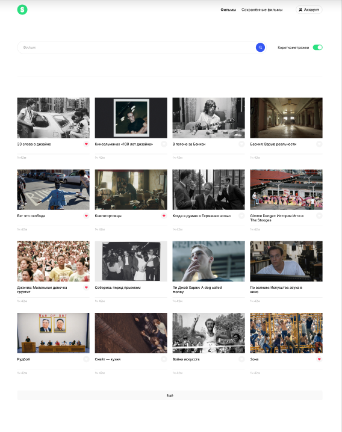
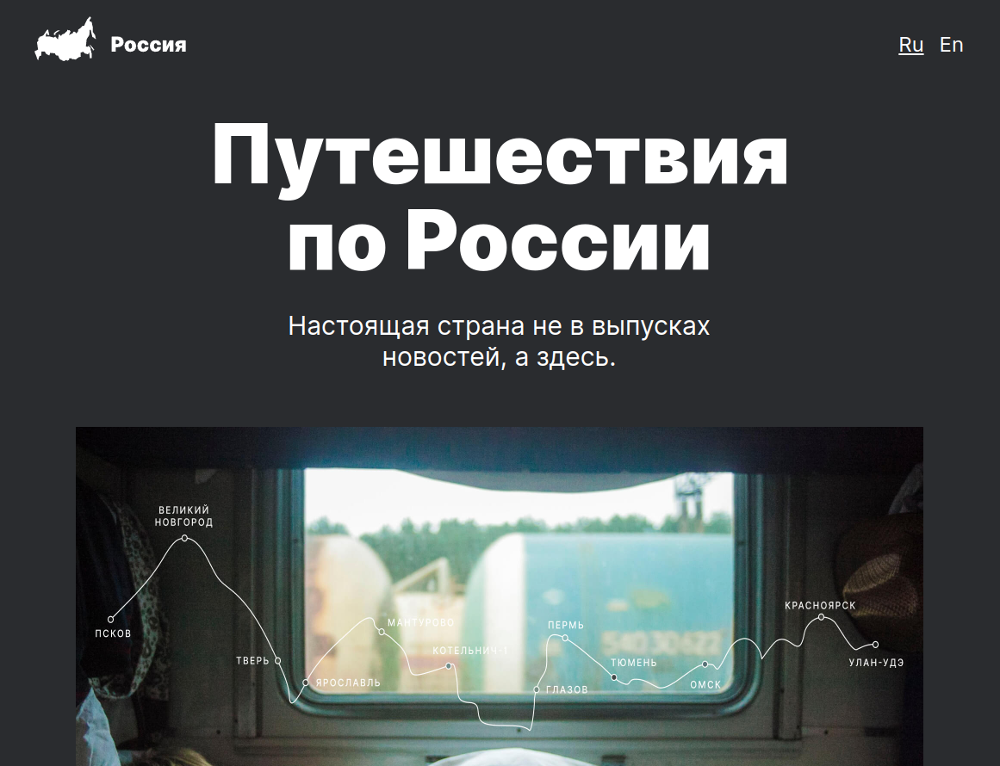
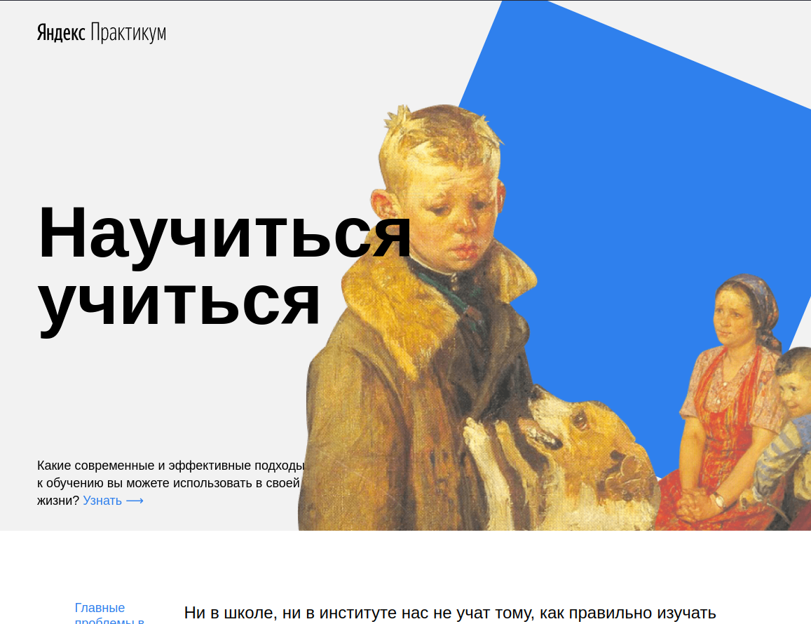
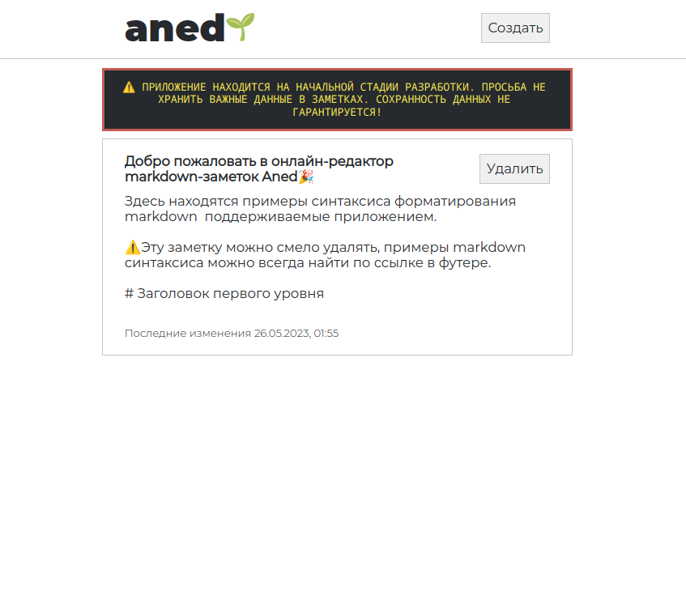

# Projects

# [Long-term support projects are listed under "Pet projects"](#pet-projects)

## Movies Explorer
> Stack: HTML CSS React.js

This web app is a portfolio site and a mini movie search that opens after registration.

\> [GitHub](https://github.com/teplostanski/movies-explorer-frontend)

 

## Mesto
> Stack: HTML CSS React.js

"Mesto" is a site where people share photos. A "place" can be anything: a city, a region, or a venue.

\> [GitHub](https://github.com/teplostanski/react-mesto-auth) 

\> [Website](https://teplostanski.github.io/react-mesto-auth/)

 

## Travel across Russia
> Stack: HTML CSS BEM 

A responsive web page "Travel across Russia" describing unusual places in Russia.

\> [GitHub](https://github.com/teplostanski/travel) 

\> [Website](https://teplostanski.github.io/travel/)

## How to learn
> Stack: HTML CSS BEM

A single-page site about modern and effective learning approaches.

\> [GitHub](https://github.com/teplostanski/how-to-learn) 

\> [Website](https://teplostanski.github.io/how-to-learn/)

# Pet projects

## aned
> Stack: HTML CSS TypeScript React.js

Pet project. Online markdown notes editor

\> [GitHub](https://github.com/teplostanski/aned) 

\> [Website](https://aned.teplostanski.dev/)

 

## Portfolio
> Stack: HTML CSS React.js

This web app is a portfolio site and a mini movie search that opens after registration.

\> [GitHub](https://github.com/teplostanski/portfolio) 

\> [Website](https://teplostanski.dev/)
